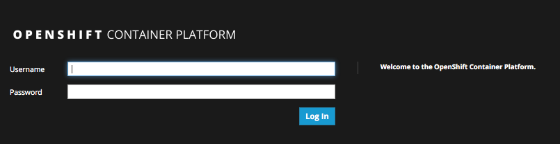
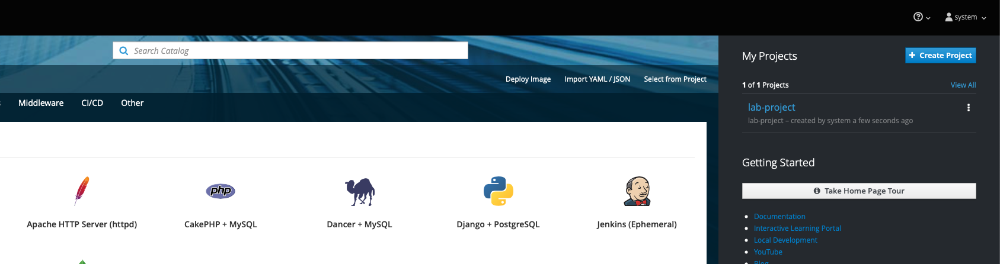
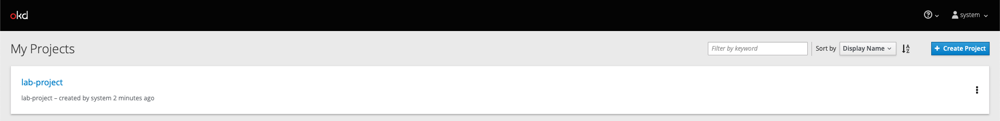
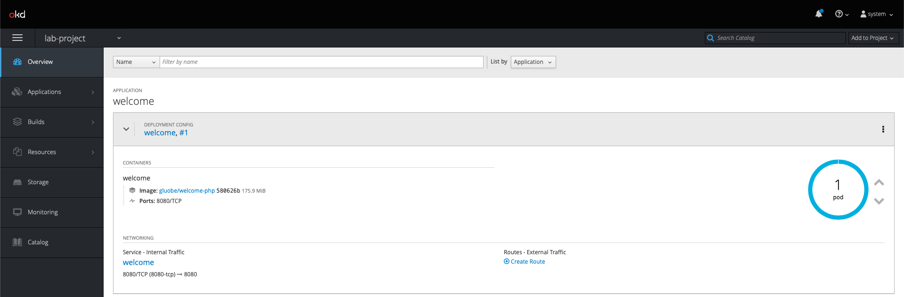
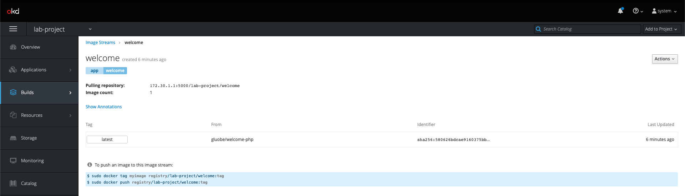
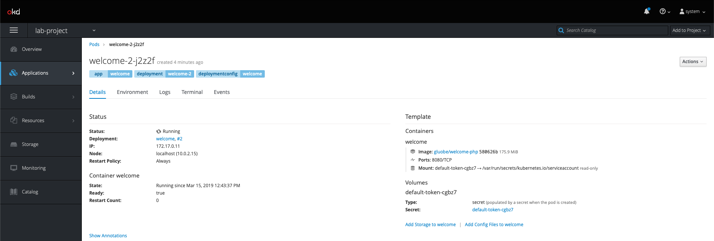

# Lab 03 - Using the web console

In this lab we will explore the Openshift Web Console.

## Task 1 : Login to the web console

Type in the master public URL provided by your instructor in a browser. Use
<master public URL>:<port>. You will be directed to an OpenShift login page.

> Your browser may complain about the server’s security certificates not trusted by your computer. You can agree to proceed to the master URL.

image::images/login.png[image]

Login with the `username` and `password` provided by the instructor. You will now see the Service Catalog. Your created project will be listed on the right.

ick on "View All" on the right. You will see the list of projects now.
Note the project you created in the last lab exercise is shown here.

Also note the `Create Project` button which allows you to create a new
project from Web Console.

Now click on the CLI Project to view the details. OpenShift takes you by
default to the `Overview` page and shows you a graphic representation of
the application that is deployed here. You can see that a single pod is
running and is front ended by a service. Note the route that you
configured for this service is also shown. You will also see the `Add to
Project` button on the top. This can be used to create new application
from Web Console inside this project.

Select `Images` under `Builds` tab, you will see all the images in the project. Click onto the image to see the details.

Select `Pods` under `Applications` tab, you will find a running pod that
is running your application image. Note that it also tells you the node
on which the pod is running and other details about this pod. You will
also see the build pod that had succeeded.

Click onto running pod, it shows the details on the pod. In addition,
metrics, logs and terminal also available for monitoring.

