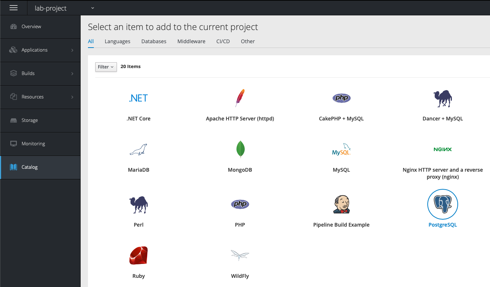
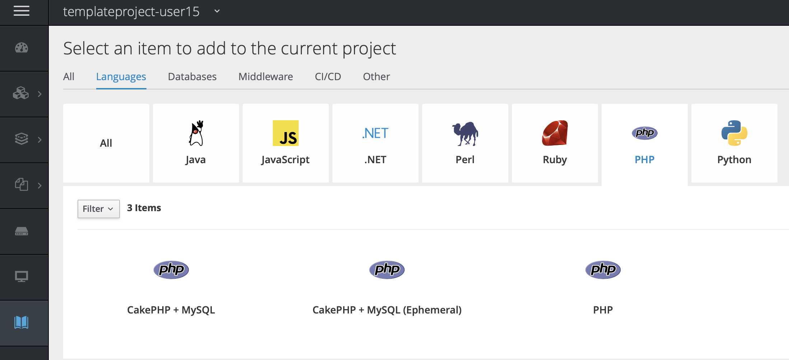
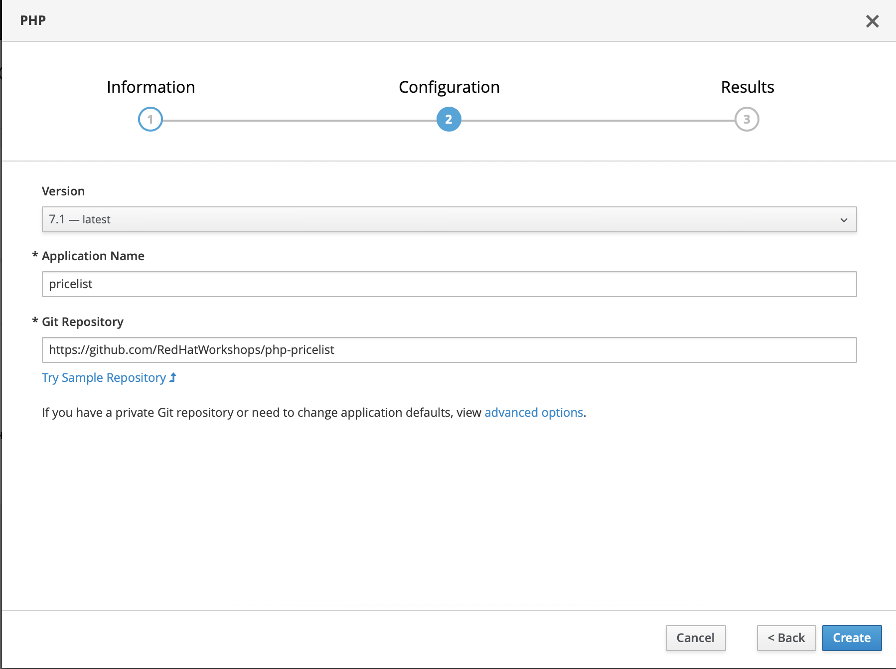
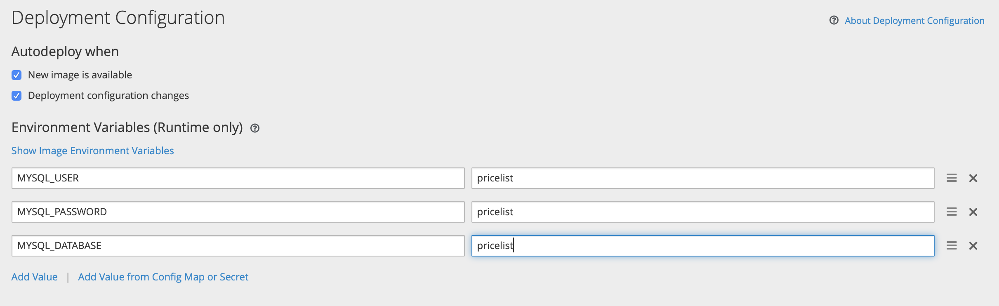

# Lab - 04 Using templates

> NOTE: Guide is not really the same on minishift, needs a good refactor.

## Task 1 : Create a Project

Login to the web console in case you are not logged in anymore. If you want you
can use a project that you have already created, otherwise create a new one.

You can use the button `Create Project` and call it `templateproject-username`.
The `Display Name` and `Description` are yours to choose. This doesn't really
matter.

Press `Create`. You can get the same result from the following command in `CLI`

```
oc new-project templateproject-username
```

## Task 2 : Create a MYSQL database using the template

Click on `Add to Project -> Browse Catolog` button and you will be taken to select an
image or template. You will see the application create screen as shown
below:



Click on `Databases` tab. Find `MySQL` then `MySQL (Ephemeral)`
template from the list and click `Select`. You will also notice `MySQL
(Persistent)` template. But we will address that in a different lab
exercise.

You will be taken to the mysql ephemeral creation screen. Click `Next`
parameters and edit the values to use the following values:

```
Add to Project: consoleproject-UserName
Database Service Name: mysql
MySQL Connection Username: pricelist
MySQL Connection Password: pricelist
MySQL root user Password: pricelist
MySQL Database Name: pricelist
```

Scroll to the `Labels` section and edit the `app` label to `pricelist`.

Click `Create`.

Go back to the Dashboard and you will see that a database instance is creating.

## Task 3 : Add a PHP frontend to talk to the database

Click on `Add to Project -> Browse Catolog` and click `Languages`. Now choose for
`PHP` and select the `PHP` template.



Click `Next` and fill in the following things in the configuration tab. The repo
we are going to use is `https://github.com/RedHatWorkshops/php-pricelist`.



Click `Advanced Options` and fill in the following environment variables in the
`Deployment configuration` tab.



Scroll down to `Labels` and in case that the `app` label is not `pricelist` change
it.

Click `create`.

Go back to the Dashboard and notice that there are currently 2 applications. You
might need to wait a little for the php application to become available.

## Task 4 : Initiate the database

Now that we have our database and our frontend PHP application we are able to
initialize the database and start filling the DB with some records.

We will need to do a few things to initialize the database tho.

Be sure that you are logged in to your own project and run the following command.
This command will initiate the database and will make sure that you can start
adding records.

```
curl -k http://$(oc get route/pricelist -o jsonpath='{.spec.host}')/create_database.php

Array
(
    [0] => 00000
    [1] =>
    [2] =>
)
```

Now run the routes command to get your route.

```
oc get route

NAME        HOST/PORT                                                          PATH      SERVICES    PORT       TERMINATION   WILDCARD
pricelist   pricelist-templateproject-user15.apps.openshift-workshop.gluo.io             pricelist   8080-tcp                 None
```

Browse to the `HOST/PORT` section of the output and start filling up the Database.
Your first screen will be a `Lorem Ipsum` text with a few buttons. To add some
records in the database press `Create Record`.

Fill in the record with some data. E.g.

```
Name : sweater
Description : a warm sweater   
Price : 60
Category : fashion  
```

Click `Save` and afterwards you will be able to `Read` the records by pressing on
the `Read Records` button.

Our first record is in our database.

## Task 5 : Delete your project

You can delete your project in the web console or via the CLI with the following
command.

```
oc delete project templateproject-${USERNAME}
```
