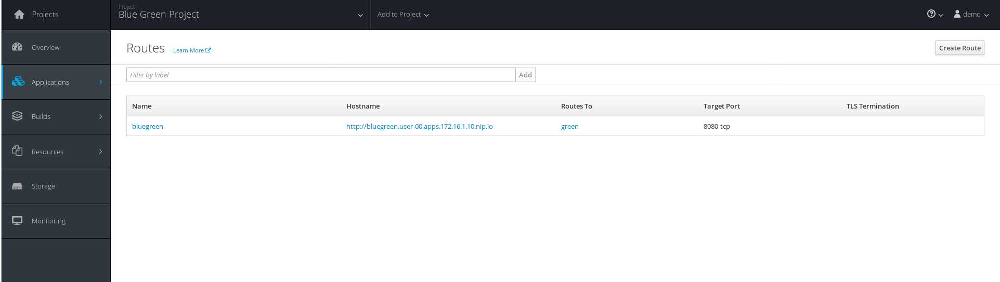
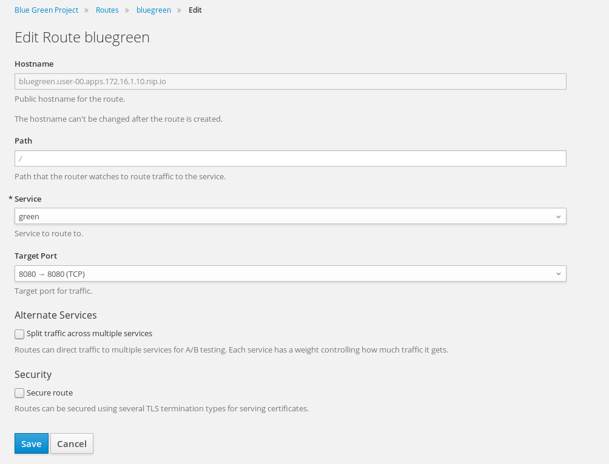
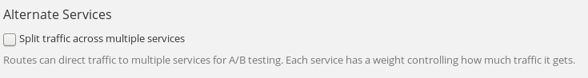
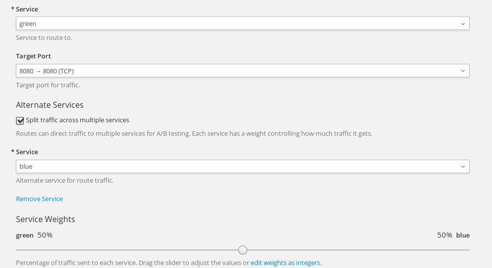
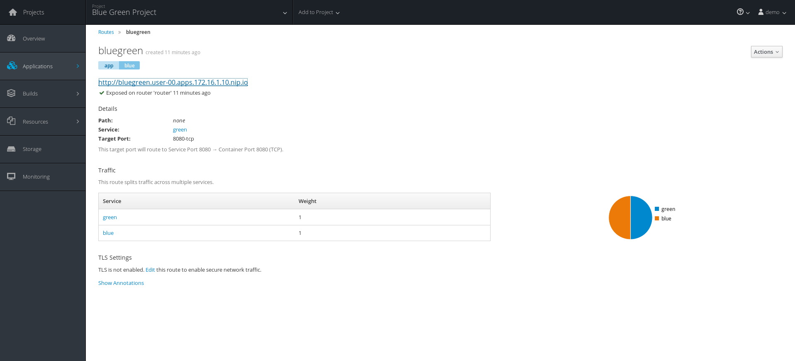

# Lab - 07 Blue/Green deployments

The purpose of this short lab is to demonstrate how simple it is to
implement Blue-Green Deployments in OpenShift.

## Task 1 : Create a new project

Remember to either change the username parameter or export it.

```
export USERNAME=<username>
```

```
oc new-project bluegreen-${USERNAME} --display-name="Blue Green Project" --description="Blue Green Project"
```

## Task 2 : Deploy the blue version

List existing image builder or image streams.

```
oc new-app -S --image-stream=php

Image streams (oc new-app --image-stream=<image-stream> [--code=<source>])
-----
php
  Project: openshift
  Tags:    7.0, 7.1, latest
```

Create an application. We will be using a sample application that displays a blue or green
rectangle. The sample app can be browsed at
https://github.com/RedHatWorkshops/bluegreen

We will be using an env var in order to change the color of the box; but
in practice you would use a different branch for each version of the
code. (E.g. v1 branch and v2 branch)

```
oc new-app --image-stream=php --code=https://github.com/RedHatWorkshops/bluegreen --env COLOR=blue --name=blue
```

Now monitor the build.

```
oc get builds

NAME      TYPE      FROM          STATUS    STARTED          DURATION
blue-1    Source    Git@9008f89   Running   20 seconds ago   
```

Using the build name of the recently created application run:

```
oc logs build/blue-1
```

Once the build finishes you should see something similar to:

```
Pushing image 172.30.1.1:5000/bluegreen-joris/blue:latest ...
Pushed 0/10 layers, 1% complete
Pushed 1/10 layers, 10% complete
Pushed 2/10 layers, 20% complete
Push successful
```

Check the application deployment status.

```
oc get pods

NAME           READY     STATUS      RESTARTS   AGE
blue-1-4pt7t   1/1       Running     0          30s
blue-1-build   0/1       Completed   0          1m
```

Notice that the build pod has exited and you now have a single instance
of the application running under one single pod.

This application displays a blue square. List the service.

```
oc get service

NAME      CLUSTER-IP      EXTERNAL-IP   PORT(S)             AGE
blue      172.30.52.106   <none>        8080/TCP,8443/TCP   3m
```

Now we need to create a route for the service.

```
oc expose service blue --name=bluegreen
```

Test the application. Do the following command an paste the `HOST/PORT` to your
browser.

```
oc get route
```

## Task 3 : Deploy the green version

Create a new application the same way as you did above in Part I. Make
sure to name the application as `green` this time.

```
oc new-app --image-stream=php --code=https://github.com/RedHatWorkshops/bluegreen --env COLOR=green --name=green
```

Wait until the application is built and deployed. You should now see
two services if you run:

```
oc get service

NAME      CLUSTER-IP       EXTERNAL-IP   PORT(S)             AGE
blue      172.30.52.106    <none>        8080/TCP,8443/TCP   13m
green     172.30.188.189   <none>        8080/TCP,8443/TCP   14s
```

Edit the previously created route and change the `service` name (from
`blue` to `green`), all the way at the bottom to the new service that
was just created. You are essentially still using the FQDN you had
previously created. However, that route will now point to a different
(green) service.

```
oc edit route bluegreen

apiVersion: v1
kind: Route
metadata:
  annotations:
    openshift.io/host.generated: "true"
  creationTimestamp: 2019-03-15T12:53:08Z
  labels:
    app: green
  name: bluegreen
  namespace: bluegreen-${USERNAME}
  resourceVersion: "76708"
  selfLink: /oapi/v1/namespaces/bluegreen-joris/routes/bluegreen
  uid: 488bf15f-4721-11e9-bae3-0800278210c7
spec:
  host: bluegreen-bluegreen-joris.192.168.99.100.nip.io
  port:
    targetPort: 8080-tcp
  to:
    kind: Service
    name: green
    weight: 100
  wildcardPolicy: None
status:
  ingress:
  - conditions:
    - lastTransitionTime: 2019-03-15T12:53:08Z
      status: "True"
      type: Admitted
    host: bluegreen-bluegreen-${USERNAME}.192.168.99.100.nip.io
    routerName: router
    wildcardPolicy: None
```

Now we are going to test the application again.

```
oc get route

NAME        HOST/PORT                                         PATH      SERVICES   PORT       TERMINATION   WILDCARD
bluegreen   bluegreen-bluegreen-${USERNAME}.192.168.99.100.nip.io             green      8080-tcp                 None
```

Copy the `HOST/PORT` section of the output in your browser and check out the green
deployment.

## Task 4 : Route traffic to both services

First we need to edit the route. Using the lefthand side navigation; click on
`Applications -> Routes`. This will bring you to the `Route` overview page.



Here, click on the  `bluegreen` route. The page after will display the current configuration.
On the upper right hand side, click on `Actions -> Edit`. You should see a page similar to
this one.



Next, tick on `Split traffic across multiple services`



Here, set the weight to 50% on blue and 50% on green. This will make it to where half the
traffic will go to the green application and half to the blue application.



Once you click on `Save`; you should see this on the Route Overview page.



You are able to test your settings now. If you try and visit your application; you'll notice it won't "switch" over
to the other application. This is because the default behavior is:

* Sticky Session on the Router
* Session Cookie set on the router

To get "true" round robin; annotate your route with the following

```
oc annotate route/bluegreen haproxy.router.openshift.io/balance=roundrobin
oc annotate route/bluegreen haproxy.router.openshift.io/disable_cookies=true
```
