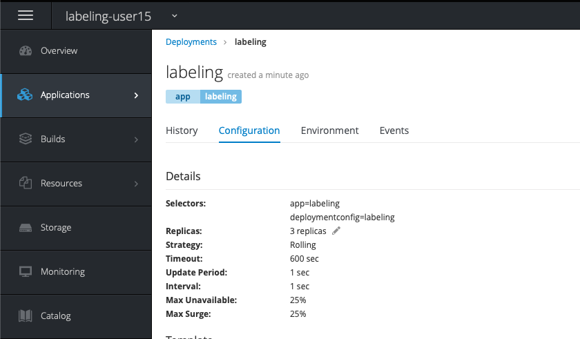

# Lab - 11 Labeling Nodes

## Task 1 : Create a new project

Create an autoscaling project with the name `labeling-${USERNAME}`.

```
oc new-project labeling-${USERNAME}
```

## Task 2 : Create and start an application with 3 replicas

We will demonstrate node labeling with an application where we spawn
3 replicas of that application. First we will not label the pods. This will make the pods scatter over our 3 compute nodes. In the second step we will label the replicas in a way that they will get
grouped on one compute node.

```
oc new-app --image-stream=php --code=https://github.com/your_github_username/bluegreen.git --name=labeling
```

If you navigate to `Applications` `Deployments` you will see your deployment. Click
on the deployment and navigate to `Configuration`. Like shown underneath you can
add replicas by clicking on the pencil and just add some more replicas.



Or you can edit the `deploymentConfig`.

```
oc edit dc labeling
```

And search for and edit the following config.

```
spec:
  replicas: 1
```

Confirm that your replicas are running on different nodes.

```
oc get pods -o wide

NAME               READY     STATUS      RESTARTS   AGE       IP             NODE
labeling-1-6xj25   1/1       Running     0          4m        10.128.16.19   compute3.openshift-workshop.gluo.internal
labeling-1-b4hhh   1/1       Running     0          4m        10.128.12.16   compute4.openshift-workshop.gluo.internal
labeling-1-whd5m   1/1       Running     0          4m        10.128.8.18    compute2.openshift-workshop.gluo.internal
```

You can see that the pods are running on compute node 3,4 and 2. With labeling you
could group these pods on one node.

## Task 3 : Edit the deploymentConfig

Edit the `deploymentConfig` with the following command.

```
oc edit dc labeling
```

Search for `template` in the config and add the `nodeSelector` parameter underneath
the spec of this `template`

```
template:
    metadata:
      annotations:
        openshift.io/generated-by: OpenShiftNewApp
      creationTimestamp: null
      labels:
        app: labeling
        deploymentconfig: labeling
    spec:
      containers:
      - image: docker-registry.default.svc:5000/labeling-user15/labeling@sha256:23ca1c9e5a043cc924e45b4587322e8432c01ac6da9b7eb049dab2025007d634
        imagePullPolicy: Always
        name: labeling
        ports:
        - containerPort: 8080
          protocol: TCP
        - containerPort: 8443
          protocol: TCP
        resources: {}
        terminationMessagePath: /dev/termination-log
      dnsPolicy: ClusterFirst
      nodeSelector:
        kubernetes.io/hostname: compute2.openshift-workshop.gluo.internal
```

When you list your pods after the recreation you will see that all the pods are
on the same node now.

```
oc get pods -o wide

NAME               READY     STATUS      RESTARTS   AGE       IP            NODE
labeling-1-build   0/1       Completed   0          17m       10.128.8.19   compute2.openshift-workshop.gluo.internal
labeling-9-bfsnl   1/1       Running     0          2m        10.128.8.27   compute2.openshift-workshop.gluo.internal
labeling-9-bgq6k   1/1       Running     0          2m        10.128.8.26   compute2.openshift-workshop.gluo.internal
labeling-9-x8n42   1/1       Running     0          2m        10.128.8.25   compute2.openshift-workshop.gluo.internal
```

## Task 4 : Delete your project

You can delete your project in the web console or via the CLI with the following
command.

```
oc delete project labeling-${USERNAME}
```
